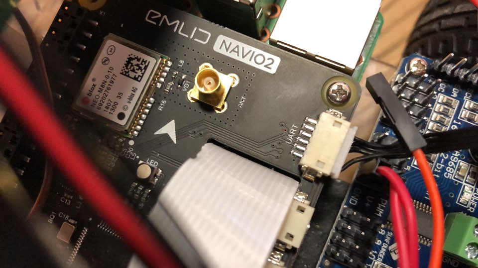

# End-to-end-self-driving
End to end self driving for self driving rover

## 1. Gathering Data Phase
1) Important points about hardware Mechanical & Circuit (Used Navio2 shield on rpi3)
2) How to bind receiver and transmitter
3) Mission Planner(UART Communication)
4) Initial setup of Navio2
5) How to calibrate
6) ETC. Trial and errors
.

## 2. Training Phase
1) Data Augmentation
2) Model
3) Important points when training

## 3. Testing Phase
1) Important points about hardware Mechanical & Circuit (Used rpi3 only)
2) Explanation how to control servo motor(pwm)
servo_test.py
3) Explanation how to control 2 dc motors(pwm)
motor.py 

.
.
